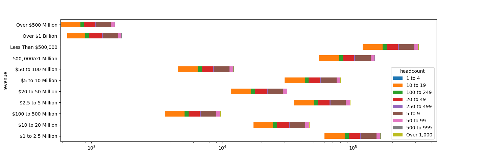
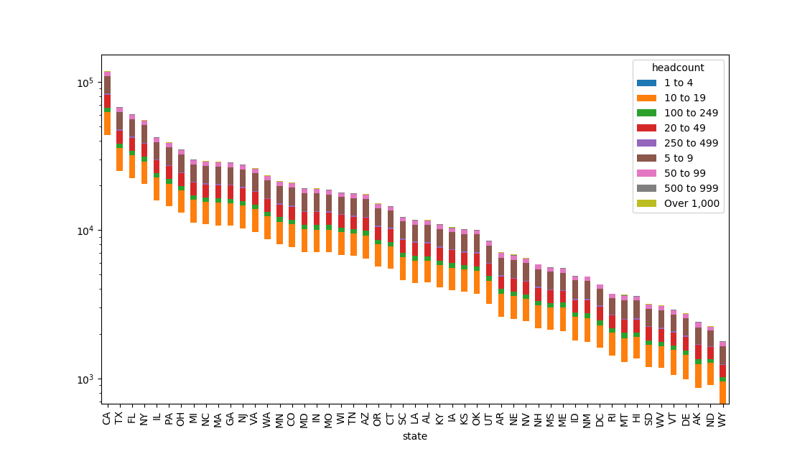
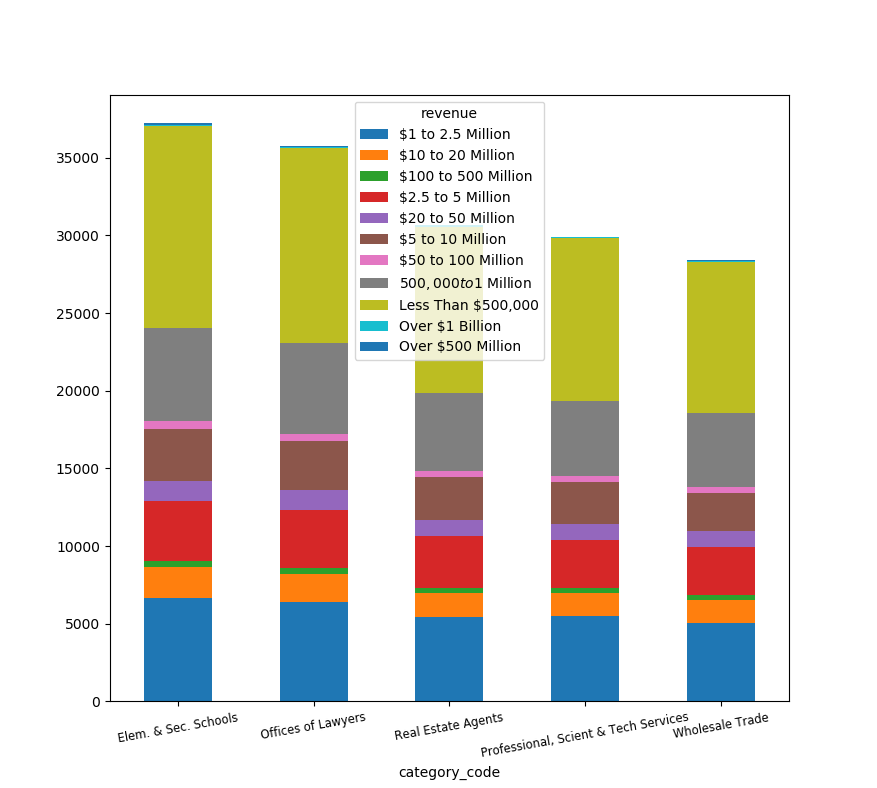

# Data Analysis of US businesses

We examined the a dataset which contains a million of records of businesses, which are representative of the distribution of companies in US based on their revenues, number of employees etc. Each company is characterized by a _category_code_. Further details on the file are discussed [here](https://github.com/RadiusIntelligence/datascience-cc-1).

We load the file as a json, then calculated the _Fill Rate_ by dropping the NAN values for each field:
 
Next, we inferred the _True-Valued Fill Rate_. We first set empty spaces, 'none' and 'null' to NAN values for all the datasets. We then treated single fields in a slightly different way:
* _zip_ code: we request that entries have 5 digits 
* _category_code_: the number of digits must be between 2 and 6, and so on.
* _phone_: we request that the field contains 10 digits
* _state_: we request 2 alphabetic characters
* the remaining fields: we request at least 2 digits

Entries which do not satisfied the aforementioned criteria have been set to NAN.

We then inferred the _Cardinality_ of each field by dropping its NAN values previously calculated and inferring the number of unique elements.

Results are reported below.

| Field       | Fill Rate             |True-Valued Fill Rate | Cardinality|
| ------------- |:-------------:|:-------------:| :-------------:|
  |   address   |   999986   |   999898  | 892115 |
  |   category_code   |   999986   | 952660  |    709 | 
  |   city   |   999986   |  999895  |  13715 |
  |   headcount   |   962352   |  962273  |  10 |
  |   name   |   999986   |  999908  |   890716 |
  |   phone   |   590889   | 590798  |  575148 | 
  |   revenue   |   943092   |  943001  |  12 |
  |   state   |   999986   |  999896  |  53 |
  |   time_in_business   |   916125   |  916048  | 6 | 
  |   zip   |   999988   |  953374  | 24410 |

Finally, we determined some _interesting_ relations from the data.

In Fig. 1 we plot the revenue vs. number of companies via a stacked bar plot, where we enlightened in different colors the contribution from businesses with different headcount (number of people employed).
 
 
 We can see that we have about 1000 big companies with 1 billion USD of revenue, while the majority of the companies is below 500,000 USD.
 
 
 
 The second figure tells us the distribution of companies per state and per number of people employed.
 
 Most of the companies are in California, Florida, Texas and NY.
 
 It is interesting to pick the first five businesses in term of total number, along with revenues. Clearly, Elementary/Secondary school and Offices of Lawyers are the largest. We note that, however, the trend in the Fig. is driven by the businesses with less than 500,000$ in revenue, while differences tends to be less pronounced for the other revenue categories.
 

